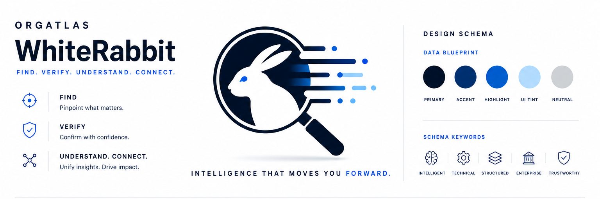

# White Rabbit Draft Design And Brand Schema - 2026-05-10

**Status:** Draft visual reference.
**Source image:** `/Users/mschwar/Documents/ChatGPT Image May 10, 2026, 10_00_49 PM.png`.
**Extracted template:** [`assets/white-rabbit-top-half-template-2026-05-10.png`](assets/white-rabbit-top-half-template-2026-05-10.png).
**Product code changed:** No.

This schema translates the top-half brand panel into reusable design direction for later UI work. It does not advance a reset gate, replace `docs/mockups/final-product-2026-05-10/`, or authorize R10-R13 UI implementation before the active reset plan unlocks it.



## Brand Position

White Rabbit should feel like an evidence engine for working operators: precise, technical, fast, and calm. The visual system should support the product truth in `docs/00-product-northstar.md`: find the public-web candidate universe, verify claims, explain uncertainty, and help an operator act without re-researching the row.

Primary brand line from the panel:

```text
Find. Verify. Understand. Connect.
```

Support line from the panel:

```text
Intelligence that moves you forward.
```

## Brand Architecture

| Element | Direction |
| --- | --- |
| Company | OrgAtlas, rendered as a small uppercase parent mark. |
| Product | White Rabbit in prose; the wordmark may render as `WhiteRabbit` when used as a graphic lockup. |
| Primary symbol | Rabbit inside a search lens with horizontal data trails. |
| App mark | Cropped lens/rabbit/data-trace mark on deep navy. |
| Concept keywords | Intelligent, technical, structured, enterprise, trustworthy. |

## Color Tokens

These draft values are sampled from the source panel and rounded into usable UI tokens.

| Token | Hex | Use |
| --- | --- | --- |
| `brand.primary` | `#001028` | Deep navy for logo mass, primary text, icon strokes, dark surfaces. |
| `brand.accent` | `#002F70` | Secondary navy-blue for active strokes, data traces, subtle emphasis. |
| `brand.highlight` | `#005ECF` | Primary action blue, active states, focused data points. |
| `brand.uiTint` | `#B2DBFE` | Soft blue fill, quiet highlights, evidence support backgrounds. |
| `brand.neutral` | `#CDD0D4` | Neutral swatches, dividers, disabled strokes. |
| `brand.paper` | `#FFFFFF` | Main light background. |
| `brand.paperWarm` | `#FFFEFE` | Off-white page field from the source image. |
| `brand.line` | `#D6DDE8` | Hairline dividers and panel separators. |
| `brand.textMuted` | `#5E6A7A` | Secondary body copy on light backgrounds. |

Do not let the interface become a one-note blue poster. Use the bright blue sparingly for actions, selected states, and verified evidence. Large working surfaces should stay mostly paper, deep navy text, and neutral dividers.

## Typography

| Role | Direction |
| --- | --- |
| Wordmark | Heavy geometric sans, tight but readable, deep navy. Product UI should use text, not embedded wordmark art, except in brand/marketing artifacts. |
| Product headings | Strong sans, high contrast, sentence case unless a compact label is needed. |
| Micro-labels | Uppercase, 0.12em to 0.22em tracking, deep navy or highlight blue. |
| Body | Plain sans with normal letter spacing, optimized for scan speed. |
| Numeric/data labels | Tabular figures where available; keep evidence counts and status numbers aligned. |

Implementation preference for the current Next app: use Geist/Inter-compatible system sans tokens already available in the app. Avoid viewport-scaled type. Avoid negative letter spacing.

## Layout Grammar

The panel uses a three-zone structure:

| Zone | Pattern |
| --- | --- |
| Left | Brand identity plus three-step operator promise: Find, Verify, Understand/Connect. |
| Center | Oversized hero mark with motion/data traces; the product symbol carries the composition. |
| Right | Design schema, swatches, and keyword/icon system. |

For product UI, translate this into a quieter operator workspace:

- Use a strong single first-screen mark or compact header mark, not a marketing hero inside the working app.
- Keep dense work areas organized by thin dividers, aligned columns, and clear status labels.
- Use icon + label pairs for repeated concepts only when the icon adds scan value.
- Reserve the full top-half panel treatment for brand docs, decks, or launch/demo framing.

## Icon And Mark Rules

- Use thin-line icons with rounded endpoints and deep navy strokes.
- Pair icon rows with short labels: `Find`, `Verify`, `Understand`, `Connect`.
- The rabbit/lens/data-trace mark is the primary symbol; do not introduce a second mascot or unrelated abstract logo.
- Use the blue data dots as evidence/provenance language, not generic decoration.
- App icons should favor the dark search mark for contrast at small sizes.

Available repo assets:

| Asset | Use |
| --- | --- |
| `apps/web/public/brand/white-rabbit-search-light.png` | Light-background lens/rabbit/data-trace mark. |
| `apps/web/public/brand/white-rabbit-search-dark.png` | Dark-background lens/rabbit/data-trace mark. |
| `apps/web/public/brand/white-rabbit-rabbit-mark.png` | Standalone rabbit mark. |
| `docs/brand/assets/white-rabbit-top-half-template-2026-05-10.png` | Top-half brand template reference. |

## Product UI Guardrails

- Do not add public landing-page, signup, billing, account, or multi-tenant surfaces from this brand schema.
- Do not let brand polish make untrusted results feel CRM-ready.
- `READY`, `REVIEW`, `ORG-ONLY`, and `NOT FOUND` remain the operator-facing result buckets from ADR-013.
- Evidence and uncertainty should be styled as first-class product states, not warnings hidden in fine print.
- Brand work should wait for the active reset queue before touching R10-R13 UI.

## Draft CSS Tokens

```css
:root {
  --wr-brand-primary: #001028;
  --wr-brand-accent: #002f70;
  --wr-brand-highlight: #005ecf;
  --wr-brand-ui-tint: #b2dbfe;
  --wr-brand-neutral: #cdd0d4;
  --wr-brand-paper: #ffffff;
  --wr-brand-paper-warm: #fffefe;
  --wr-brand-line: #d6dde8;
  --wr-brand-text-muted: #5e6a7a;
}
```

## Open Questions

- Should the final operator UI reconcile this light, clinical brand direction with the current dark final-product mockup, or should one become dominant?
- Should the product wordmark stay `WhiteRabbit` as a graphic mark while prose remains `White Rabbit`?
- If these assets become production-critical, replace the raster crops with vector source artwork.
